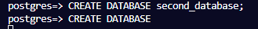
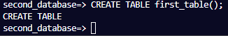
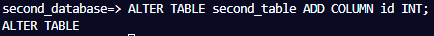
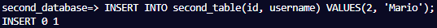
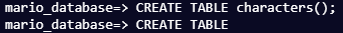
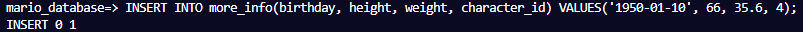
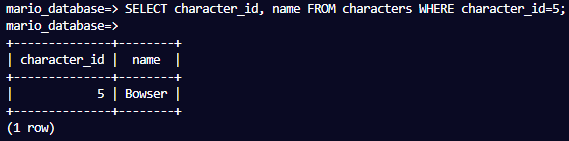
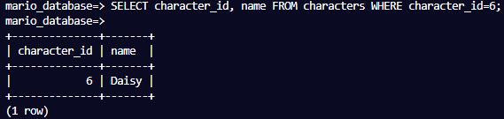
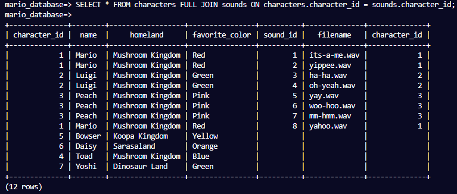

<h1 align="center">
    Mario Database
</h1>

    I learnt the basics of a relational database by creating a PostgreSQL database.

## Steps
**S1** 
The first thing you need to do is start the terminal. Do that by clicking the "hamburger" menu at the top left of the screen, going to the "terminal" section, and clicking "new terminal". Once you open a new one, type `echo hello PostgreSQL` into the terminal and press enter.

**S2** 
Your virtual machine comes with PostgreSQL installed. You will use the Psql terminal application to interact with it. 

Log in by typing `psql --username=freecodecamp --dbname=postgres` into the terminal and pressing enter.

**S3** 
Notice that the prompt changed to let you know that you are now interacting with PostgreSQL. First thing to do is see what databases are here. 

Type `\l` into the prompt to list them.

**S4** 
The databases you see are there by default. You can make your own like this: 
`CREATE DATABASE database_name;` 
The capitalized words are keywords telling PostgreSQL what to do. The name of the database is the lowercase word. Note that all commands need a <b>semi-colon</b> at the end. 

Create a new database named `first_database`.

**S5** 
Use the list shortcut co6mand again to make sure your new database is there.

**S6** 
It worked. Your new database is there. If you don't get a message after entering a command, it means it's incomplete and you likely forgot the semi-colon. You can just add it on the next line and press enter to finish the command. 

Create another database named `second_database`.

**S7** 
You should have another new database now. List the databases to make sure

**S8** 
You can connect to a database by entering `\c database_name`. You need to connect to add information. 

Connect to your `second_database`.

**S9** 
You should see a message that you are connected. Notice that the prompt changed to `second_database=>`. So the `postgres=>` prompt before must have meant you were connected to that database. A database is made of tables that hold your data. 

Enter `\d` to display the tables.

**S10** 
Looks like there's no tables or relations yet. Similar to how you created a database, you can create a table like this: 
`CREATE TABLE table_name();` 

Create a table named `first_table` in `second_database`.

**S11** 
View the tables in `second_database` again with the display command. You should see your new table there with a little meta data about it.

**S12** 
Create another new table in this database. Give it a name of `second_table`.

**S13** 
There should be two tables in this database now. Display them again to make sure.

**S14** 
You can view more details about a table by adding the table name after the display command like this: 
`\d table_name` 
View more details about your `second_table`.

**S15** 
Tables need columns to describe the data in them, yours doesn't have any yet. Here's an example of how to add one: 
`ALTER TABLE table_name ADD COLUMN column_name DATATYPE;` 

Add a column to `second_table` named `first_column`. Give it a data type of `INT`. `INT` stands for integer. Don't forget the semi-colon.

**S16** 
Looks like it worked. Display the details of `second_table` again to see if your new column is there.

**S17** 
Your column is there. Use `ALTER TABLE` and `ADD COLUMN` to add another column to `second_table` named `id` that's a type of `INT`.

**S18** 
Your table should have an `id` column added. View the details of `second_table` to make sure.

**S19** 
Add another column to `second_table` named `age`. Give it a data type of `INT`.

**S20** 
Take a look at the details of `second_table` again.

**S21** 
Those are some good looking columns. You will probably need to know how to remove them. Here's an example: 
`ALTER TABLE table_name DROP COLUMN column_name;` 

Drop your `age` column.

**S22** 
View the details of `second_table` to see if it's gone.

**S23** 
It's gone. Use the `ALTER TABLE` and `DROP COLUMN` keywords again to drop `first_column`.

**S24** 
A common data type is `VARCHAR`. It's a short string of characters. You need to give it a maximum length when using it like this: 
`VARCHAR(30)` 

Add a new column to `second_table`, give it a name of `name` and a data type of `VARCHAR(30)`.

**S25** 
Take a look at the details of `second_table` to see your columns.

**S26** 
You can see the `VARCHAR` type there. The `30` means the data in it can be a max of 30 characters. You named that column `name`, it should have been `username`. Here's how you can rename a column: 
`ALTER TABLE table_name RENAME COLUMN column_name TO new_name;` 

Rename the `name` column to `username`.

**S27** 
Take a look at the details of `second_table` again to see if it got renamed.

**S28** 
It worked. Rows are the actual data in the table. You can add one like this: 
`INSERT INTO table_name(column_1, column_2) VALUES(value1, value2);` 

Insert a row into `second_table`. Give it an `id` of `1`, and a `username` of `Samus`. The username column expects a `VARCHAR`, so you need to put Samus in single quotes like this: `'Samus'`.

**S29** 
You should have one row in your table. You can view the data in a table by querying it with the `SELECT` statement. Here's how it looks: 
`SELECT columns FROM table_name;` 

Use a `SELECT` statement to view all the columns in `second_table`. Use an asterisk (`*`) to denote that you want to see all the columns.

**S30** 
There's your one row. Insert another row into `second_table`. 

Fill in the `id` and `username` columns with the values `2` and `'Mario'`.

**S31** 
You should now have two rows in the table. Use `SELECT` again to view all the columns and rows from `second_table`.

**S32** 
Insert another row into `second_table`. Use `3` as the `id`, and `Luigi` as the `username` this time.

**S33** 
You should now have three rows. Use `SELECT` again to see all the data you entered.

**S34** 
That gives me an idea. You can make a database of Mario video game characters. You should start from scratch for it. Why don't you delete the record you just entered. Here's an example of how to delete a row: 
`DELETE FROM table_name WHERE condition;` 

Remove Luigi from your table. The condition you want to use is `username='Luigi'`.

**S35** 
Luigi should be gone. Use `SELECT` again to see all the data and make sure he's not there.

**S36** 
It's gone. You can scrap all this for the new database.  

Delete Mario from `second_table` using the same command as before, except make the condition `username='Mario'` this time.

**S37** 
Only one more row should remain. Delete Samus from `second_table`.

**S38** 
Use `SELECT` again to see all the rows in `second_table` to make sure they're gone.

**S39** 
Looks like they're all gone. Remind yourself what columns you have in `second_table` by looking at its details.

**S40** 
There's two columns. You won't need either of them for the Mario database. Alter the table `second_table` and drop the column `username`.

**S41** 
Next, drop the `id` column.

**S42** 
Okay, the table has no rows or columns left. View the tables in this database to see what is here.

**S43** 
Still two. You won't need either of those for the new database either. 

Drop `second_table` from your database. Here's an example: 
`DROP TABLE table_name;`

**S44** 
Next, drop `first_table` from the database.

**S45** 
All the tables are gone now, too. View all the databases using the command to list them.

**S46** 
Rename `first_database` to `mario_database`. You can rename a database like this: 
`ALTER DATABASE database_name RENAME TO new_database_name;`

**S47** 
List the databases to make sure it got renamed.

**S48** 
Connect to your newly named database so you can start adding your characters.

**S49** 
Now that you aren't connected to `second_database`, you can drop it. 

Use the `DROP DATABASE` keywords to do that.

**S50** 
List the databases again to make sure it's gone.

**S51** 
Okay, I think you're ready to get started. I don't think you created any tables here, take a look to make sure.

**S52** 
Create a new table named `characters`, it will hold some basic information about Mario characters.

**S53** 
Next, you can add some columns to the table. Add a column named `character_id` to your new table that is a type of `SERIAL`.

**S54** 
The `SERIAL` type will make your column an `INT` with a `NOT NULL` constraint, and automatically increment the integer when a new row is added. View the details of the `characters` table to see what `SERIAL` did for you.

**S55** 
Add a column to `characters` called `name`. Give it a data type of `VARCHAR(30)`, and a constraint of `NOT NULL`. Add a constraint by putting it right after the data type.

**S56** 
You can make another column for where they are from. Add another column named `homeland`. 

Give it a data type of `VARCHAR` that has a max length of `60`.

**S57** 
Video game characters are quite colorful. Add one more column named `favorite_color`. Make it a `VARCHAR` with a max length of `30`.

**S58** 
You should have four columns in `characters`. Take a look at the details of it to see how things are going.

**S59** 
You are ready to start adding some rows. First is Mario. Earlier, you used this command to add a row: 
`INSERT INTO second_table(id, username) VALUES(1, 'Samus');`
The first parenthesis is for the column names, you can put as many columns as you want. The second parenthesis is for the values for those columns.  

Add a row to your table, give it a `name` of `Mario`, a `homeland` of `Mushroom Kingdom`, and a `favorite_color` of `Red`. Make sure to use single quotes where needed.

**S60** 
Mario should have a row now and his `character_id` should have been automatically added. View all the data in your `characters` table with `SELECT` to see this.

**S61** 
Add another row for Luigi. Give it a `name` of `Luigi`, a `homeland` of `Mushroom Kingdom`, and a `favorite_color` of `Green`.

**S62** 
View all the data in your `characters` table with `SELECT` again.

**S63** 
Okay, it looks like it's all working. Add another row for Peach. Give her the values: `Peach`, `Mushroom Kingdom`, and `Pink`.

**S64** 
Adding rows one at a time is quite tedious. Here's an example of how you could have added the previous three rows at once: 
`INSERT INTO characters(name, homeland, favorite_color)` 
`VALUES('Mario', 'Mushroom Kingdom', 'Red'),` 
`('Luigi', 'Mushroom Kingdom', 'Green'),` 
`('Peach', 'Mushroom Kingdom', 'Pink');` 

Add two more rows. Give the first one the values: `Toadstool`, `Mushroom Kingdom`, and `Red`. Give the second one: `Bowser`, `Mushroom Kingdom`, and `Green`. Try to add them with one command.

**S65** 
If you don't get a message after a command, it is likely incomplete. This is because you can put a command on multiple lines. 

Add two more rows. Give the first one the values: `Daisy`, `Sarasaland`, and `Yellow`. The second: `Yoshi`, `Dinosaur Land`, and `Green`. Try to do it with one command.

**S66** 
Take a look at all the data in your table with `SELECT` to see where you stand.

**S67** 
It looks good, but there's a few mistakes. You can change a value like this: 
`UPDATE table_name SET column_name=new_value WHERE condition;` 
The command you just used does exactly what it sounds like. It finds the row where `name` is `Daisy`, and sets her `favorite_color` to `Orange`. Take a look at all the data in your table again to see if she got updated.

**S69** 
Her favorite color was updated. Toadstool's name is wrong as well, it's actually `Toad`. Use `UPDATE` to `SET` his `name` to `Toad`. Use the condition `favorite_color='Red'`.

**S70** 
Take a look at all the data in your table.

**S71** 
Using `favorite_color='Red'` was not a good idea. Mario's name changed to Toad because he likes red, and now there's two rows that are the same. Well, almost. Only the `character_id` is different. You will have to use that to change it back to `Mario`. Use `UPDATE` to set the `name` to `Mario` for the row with the lowest `character_id`.

**S72** 
Take a look at all the data in your table again to see if Mario's name got changed back.

**S73** 
Looks like it worked. Toad's favorite color is wrong. He likes blue. Change Toad's favorite color to `Blue`. Use whatever condition you want, but don't change any of the other rows.

**S74** 
Bowser's `favorite_color` is wrong. He likes `Yellow`. Why don't you update it without changing any of the other rows?

**S75** 
Bowser's `homeland` is wrong as well. He's from the `Koopa Kingdom`. Why don't you change it to that without changing any other rows?

**S76** 
Take a look at all the data in your table again to make sure there's no more issues.

**S77** 
Actually, you should put that in order. Here's an example: 
`SELECT columns FROM table_name ORDER BY column_name;` 
It looks good. Next, you are going to add a primary key. It's a column that uniquely identifies each row in the table. Here's an example of how to set a `PRIMARY KEY`: 
`ALTER TABLE table_name ADD PRIMARY KEY(column_name);` 

The `name` column is pretty unique, why don't you set that as the primary key for this table.

**S79** 
You should set a primary key on every table and there can only be one per table. Take a look at the details of your `characters`
table to see the primary key at the bottom.

**S80** 
You can see the key for your `name` column at the bottom. It would have been better to use `character_id` for the primary key. Here's an example of how to drop a constraint: 
`ALTER TABLE table_name DROP CONSTRAINT constraint_name;`

Drop the primary key on the `name` column. You can see the constraint name is `characters_pkey`.

**S81** 
View the details of the characters table to make sure it's gone.

**S82** 
It's gone. Set the primary key again, but use the `character_id` column this time.

**S83** 
View the details of the `characters` table to see the new primary key.

**S84** 
That's better. The table looks complete for now. Next, create a new table named `more_info` for some extra info about the characters.

**S85** 
View the tables in `mario_database` again with the display command. You should have two tables now.

**S86** 
I wonder what that third one is. It says `characters_character_id_seq`. I think I have a clue. View the details of the `characters` table.

**S87** 
That is what finds the next value for the `character_id` column. Add a column to your new table named `more_info_id`. Make it a type of `SERIAL`.

**S88** 
Set your new column as the primary key for this table.

**S89** 
View the tables in `mario_database` again with the display command. There should be another sequence there for the `more_info_id` because it also automatically increments.

**S90** 
There it is. Add another column to `more_info` named `birthday`. Give it a data type of `DATE`.

**S91** 
Add a `height` column to `more_info` that's a type of `INT`.

**S92** 
Add a `weight` column. Give it a type of `NUMERIC(4, 1)`. That data type is for decimals. `NUMERIC(4, 1)` has up to four digits and one of them has to be to the right of the decimal.

**S93** 
Take a look at the details of `more_info` to see all your columns.

**S94** 

There’s your four columns and the primary key you created at the bottom. To know what row is for a character, you need to set a foreign key so you can relate rows from this table to rows from your `characters` table. Here's an example that creates a column as a foreign key: 
`ALTER TABLE table_name ADD COLUMN column_name DATATYPE REFERENCES referenced_table_name(referenced_column_name);` 

That's quite the command. In the `more_info` table, create a `character_id` column. Make it an `INT` and a foreign key that references the `character_id` column from the `characters` table. Good luck.

**S95** 
To set a row in `more_info` for Mario, you just need to set the `character_id` (foreign key) value to whatever it is in the `characters` table. Take a look at the details of `more_info` to see your foreign key.

**S96** 
There's your foreign key at the bottom. These tables have a "one-to-one" relationship. One row in the `characters` table will be related to exactly one row in `more_info` and vice versa. Enforce that by adding the `UNIQUE` constraint to your foreign key. Here's an example: 
`ALTER TABLE table_name ADD UNIQUE(column_name);` 

Add the `UNIQUE` constraint to the column you just added.

**S97** 
The column should also be `NOT NULL` since you don't want to have a row that is for nobody. Here's an example: 
`ALTER TABLE table_name ALTER COLUMN column_name SET NOT NULL;` 

Add the `NOT NULL` constraint to your foreign key column.

**S98** 
Take a look at the details of your `more_info` table to see all the keys and constraints you added.

**S99** 
The structure is set, now you can add some rows. First, you need to know what `character_id` you need for the foreign key column. You have viewed all columns in a table with `*`. You can pick columns by putting in the column name instead of `*`. Use `SELECT` to view the `character_id` column from the `characters` table.

**S100** 
That list of numbers doesn't really help. Use `SELECT` again to display both the `character_id` and `name` columns from the `characters` table. You can separate the column names with a comma to view both.

**S101** 
That's better. You can see Mario's id there. Here's some more info for him: 
`birthday	height	weight` 
`1981-07-09	155	64.5` 

Add a row to `more_info` with the above data for Mario using the `INSERT INTO` and `VALUES` keywords. Be sure to set his `character_id` when adding him. Also, `DATE` values need a string with the format: `'YYYY-MM-DD'`.

**S102** 
View all the data in `more_info` to make sure it's looking good.

**S103** 
Next, you are going to add some info for Luigi. Use `SELECT` again to view the `character_id` and `name` columns from the `characters` table to find his id.

**S104** 
You can see Luigi's id there. Here's his info: 
`birthday	height	weight` 
`1983-07-14	175	48.8` 

Add a row in `more_info` for Luigi using the above info. Be sure to add his `character_id` as well.

**S105** 
View all the data in `more_info` to see more info for Luigi.

**S106** 
Peach is next. View the `character_id` and `name` columns from the `characters` table again so you can find her id.

**S107** 
Here's the additional info for Peach: 
`birthday	height	weight` 
`1985-10-18	173	52.2` 

Add a row for Peach using the above info. Be sure to add her `character_id` as well.

**S108** 
Toad is next. Instead of viewing all the rows to find his id, you can just view his row with a `WHERE` condition. You used several earlier to delete and update rows. You can use it to view rows as well. Here's an example: 
`SELECT columns FROM table_name WHERE condition;` 

A condition you used before was `username='Samus'`. Find Toad's id by viewing the `character_id` and `name` columns from `characters` for only his row.

**S109** 
Here's what Toad's info looks like: 
`birthday	height	weight` 
`1950-01-10	66	35.6` 

Add the above info for Toad. Be sure to add his `character_id`.

**S110** 
View all the data in `more_info` to see the rows you added.

**S111** 
Bowser is next. Find his id by viewing the `character_id` and `name` columns for only his row.

**S112** 
Here's what Bowser's info looks like: 
`birthday	height	weight` 
`1990-10-29	258	300` 

Add the above info for Bowser. Don't forget to add his `character_id`.

**S113** 
Daisy is next. Find her id by viewing the `character_id` and `name` columns for only her row.

**S114** 
The info for Daisy looks like this: 
`birthday	height	weight` 
`1989-07-31	NULL	NULL` 

Add the above info for Daisy to `more_info`. Be sure to add her `character_id` as well. You can use `NULL` or simply not include the null columns when inserting.

**S115** 
View all the data in `more_info` to see the rows you added.

**S116** 
Null values show up as blank. Yoshi is last. Find his id by viewing the `character_id` and `name` columns for only his row

**S117** 
The info for Yoshi looks like this: 
`birthday	height	weight` 
`1990-04-13	162	59.1` 

Add the above info for Yoshi to `more_info`. Be sure to include his `character_id`.

**S118** 
There should be a lot of data in `more_info` now. Take a look at all the rows and columns in it.

**S119** 
It looks good. There is something you can do to help out though. What units do the `height` and `weight` columns use? It's centimeters and kilograms, but nobody will know. Rename the `height` column to `height_in_cm`.

**S120** 
Rename the `weight` column to `weight_in_kg`.

**S121** 
Take a quick look at all the data in `more_info` to see the new column names.

**S122** 
Next, you will make a `sounds` table that holds filenames of sounds the characters make. You created your other tables similar to this: 
`CREATE TABLE table_name();` 

Inside those parenthesis you can put columns for a table so you don't need to add them with a separate command, like this: 
`CREATE TABLE table_name(column_name DATATYPE CONSTRAINTS);` 

Create a new table named `sounds`. Give it a column named `sound_id` of type `SERIAL` and a constraint of `PRIMARY KEY`.

**S123** 
View the tables in `mario_database` to make sure it worked.

**S124** 
There's your `sounds` table. Add a column to it named `filename`. Make it a `VARCHAR` that has a max length of `40` and with constraints of `NOT NULL` and `UNIQUE`. You can put those constraints at the end of the query to add them all.

**S125** 
You want to use `character_id` as a foreign key again. This will be a "one-to-many" relationship because one character will have many sounds, but no sound will have more than one character. Here's the example again: 
`ALTER TABLE table_name ADD COLUMN column_name DATATYPE CONSTRAINT REFERENCES referenced_table_name(referenced_column_name);` 

Add a column to `sounds` named `character_id`. Give it the properties `INT`, `NOT NULL`, and set it as a foreign key that references `character_id` from `characters`.

**S126** 
Take a look at the details of the `sounds` table to see all the columns.

**S127** 
Next, you will add some rows. But first, view all the data in `characters` so you can find the correct id's again. Order them by `character_id` like you did earlier.

**S128** 
The first file is named `its-a-me.wav`. Insert it into the `sounds` table with Mario's id as the `character_id`.

**S129** 
Add another row with a `filename` of `yippee.wav`. Use Mario's `character_id` again for the foreign key value.

**S130** 
Add another row to `sounds` for Luigi named `ha-ha.wav`. Use his `character_id` this time. Take a look at the data in `characters` to find his id if you need to.

**S131** 
Add another row with a filename of `oh-yeah.wav`. This one is for Luigi as well so use his `character_id` again.

**S132** 
Add two more rows for Peach sounds. The filenames are `yay.wav` and `woo-hoo.wav`. Don't forget her `character_id`. Try to do it with one command.

**S133** 
Add two more rows. The filenames are `mm-hmm.wav` and `yahoo.wav`. The first one is for Peach again, the second is for Mario, so use the correct foreign key values. Try to do it with one command.

**S134** 
View all the data in the `sounds` table. You should be able to see the "one-to-many" relationship better. One character has many sounds.

**S135** 
See the "one-to-many" relationship? Create another new table called `actions`. Give it a column named `action_id` that's a type of `SERIAL`, and make it the `PRIMARY KEY`. Try to create the table and add the column with one command.

**S136** 
Add a column named `action` to your new table. Give it a type of `VARCHAR` that is a max length of `20` and has `UNIQUE` and `NOT NULL` constraints.

**S137** 
The actions table won't have any foreign keys. It's going to have a "many-to-many" relationship with the characters table. This is because many of the characters can perform many actions. You will see why you don't need a foreign key later.  

Insert a row into the `actions` table. Give it an `action` of `run`.

**S138** 
Insert another row into the `actions` table. Give it an `action` of jump.

**S139** 
Add another action row with an `action` of `duck`.

**S140** 
View all the data in actions to make sure there's no mistakes.

**S141** 
It looks good. "Many-to-many" relationships usually use a junction table to link two tables together, forming two "one-to-many" relationships. Your `characters` and `actions` table will be linked using a junction table. Create a new table called `character_actions`. It will describe what actions each character can perform.

**S142** 
Your junction table will use the primary keys from the `characters` and `actions` tables as foreign keys to create the relationship. Add a column named `character_id` to your junction table. Give it the type of `INT` and constraint of `NOT NULL`.

**S143** 
The foreign keys you set before were added when you created the column. You can set an existing column as a foreign key like this: 
`ALTER TABLE table_name ADD FOREIGN KEY(column_name) REFERENCES referenced_table(referenced_column);` 

Set the `character_id` column you just added as a foreign key that references the `character_id` from the characters table.

**S144** 
View the details of the `character_actions` table to see the foreign key you added.

**S145** 
Add another column to `character_actions` named `action_id`. Give it a type of `INT` and constraint of `NOT NULL`.

**S146** 
This will be a foreign key as well. Set the `action_id` column you just added as a foreign key that references the `action_id` column from the `actions` table.

**S147** 
View the details of the character_actions table to see your keys.

**S148** 
Every table should have a primary key. Your previous tables had a single column as a primary key. This one will be different. You can create a primary key from two columns, known as a composite primary key. Here's an example: 
`ALTER TABLE table_name ADD PRIMARY KEY(column1, column2);` 

Use `character_id` and `action_id` to create a composite primary key for this table.

**S149** 
This table will have multiple rows with the same `character_id`, and multiple rows the same `action_id`. So neither of them are unique. But you will never have the same `character_id` and `action_id` in a single row. So the two columns together can be used to uniquely identify each row. View the details of the `character_actions` table to see your composite key.

**S150** 
Insert three rows into character_actions for all the actions Yoshi can perform. He can perform all of them in the actions table. View the data in the characters and actions table to find the correct id's for the information.

**S151** 
View all the data in `character_actions` to see your rows.

**S152** 
Add three more rows into `character_actions` for all of Daisy's actions. She can perform all of the actions, as well.

**S153** 
Bowser can perform all the actions. Add three rows to the table for him.

**S154** 
Next is Toad. Add three more rows for his actions.

**S155** 
You guessed it. Peach can perform all the actions as well, so add three more rows for her.

**S156** 
Add three more rows for Luigi's actions.

**S157** 
Last is Mario, add three rows for his actions.

**S158** 
That was a lot of work. View all the data in `character_actions` to see the rows you ended up with.

**S159** 
Well done. The database is complete for now. Take a look around to see what you ended up with. First, display all the tables you created.

**S160** 
There's five tables there. Nice job. Next, take a look at all the data in the `characters` table.

**S161** 
Those are some lovely characters. View all the data in the `more_info` table.

**S162** 

You can see the `character_id` there so you just need to find the matching id in the `characters` table to find out who it's for. Or... You added that as a foreign key, that means you can get all the data from both tables with a `JOIN` command: 
`SELECT columns FROM table_1 FULL JOIN table_2 ON table_1.primary_key_column = table_2.foreign_key_column;` 

Enter a join command to see all the info from both tables. The two tables are `characters` and `more_info`. The columns are the `character_id` column from both tables since those are the linked keys.

**S163** 
Now you can see all the info from both tables. If you recall, that's a "one-to-one" relationship. So there's one row in each table that matches a row from the other. Use another `JOIN` command to view the `characters` and `sounds` tables together. They both use the `character_id` column for their keys as well.

**S164** 

This shows the "one-to-many" relationship. You can see that some of the characters have more than one row because they have many sounds. How can you see all the info from the `characters`, `actions`, and `character_actions` tables? Here's an example that joins three tables: 
`SELECT columns FROM junction_table` 
`FULL JOIN table_1 ON junction_table.foreign_key_column = table_1.primary_key_column` 
`FULL JOIN table_2 ON junction_table.foreign_key_column = table_2.primary_key_column;` 

Congratulations on making it this far. This is the last step. View all the data from `characters`, `actions`, and `character_actions` by joining all three tables. When you see the data, be sure to check the "many-to_many" relationship. Many characters will have many actions.

